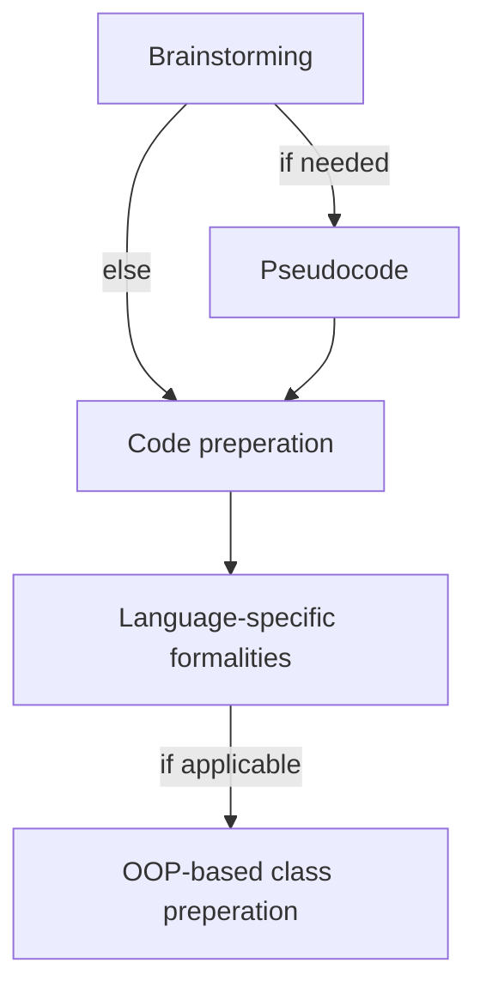

# How I develop software

```mermaid
    graph TD;
        A[Brainstorming] --> |if needed| B[Pseudocode];
        A[Brainstorming] --> |else| C[Code preperation];
        B[Pseudocode] --> C[Code preperation]
        C[Code preperation]--> D[Language-specific formalities]
        D[Language-specific formalities] --> |if applicable| E[OOP-based class preperation]
      
```

...
